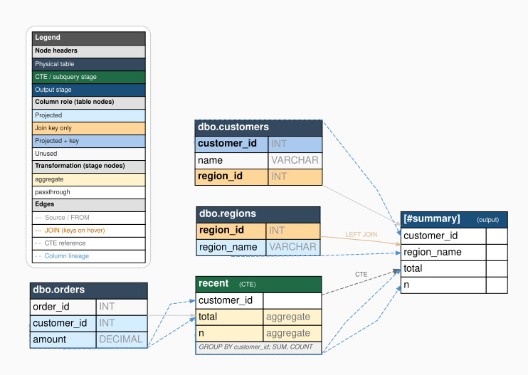

# Rdataflow



**Rdataflow** visualises the column-level data flow of a SQL script. Given a
SQL script and optional database metadata, it parses the query, traces each
column from its source table through every CTE and join to the final output,
and renders an interactive flow diagram in the RStudio Viewer.

## Key features

- **Column-level lineage** — every column is tracked from source table to output
- **Full catalog view** — all table columns are shown; unused columns are visually dimmed (`max_cols` caps very wide tables)
- **Join annotations** — join keys are highlighted and shown on edge labels together with the join type (`LEFT JOIN` + `r.region_id = c.region_id`)
- **Transformation badges + tooltips** — each stage flags aggregations, date calculations, CASE expressions, window functions, and more; hover a stage column to see the full SQL expression it computes, and each stage shows its `WHERE` filter
- **Statement clusters** — multi-statement scripts draw each statement's stages in a labelled box
- **Textual narrative** — `explain_sqlflow()` renders the same lineage as plain text or markdown, ready to paste into a PR or doc
- **Export** — `save_sqlflow()` writes `.dot`, `.svg`, `.png`, or `.pdf`
- **No silent gaps** — statements that cannot be parsed are reported with a warning, never quietly dropped
- **T-SQL first** — designed for SQL Server / T-SQL; other dialects supported via the `dialect` argument

## Installation

```r
# Install from GitHub (development version)
devtools::install_github("JasperCain01/Rdataflow")
```

If you get a credentials error (`invalid gitcreds credentials in env var 'GITHUB_PAT_GITHUB_COM'`), an invalid token stored in your environment is interfering. Clear it and retry:

```r
Sys.unsetenv("GITHUB_PAT_GITHUB_COM")
devtools::install_github("JasperCain01/Rdataflow")
```

Alternatively, install by cloning the repo and installing locally — this avoids GitHub authentication entirely:

```r
# In a terminal:
# git clone https://github.com/JasperCain01/Rdataflow.git
devtools::install("path/to/Rdataflow")
```

Rdataflow requires the Python `sqlglot` library. Install it once after loading the package:

```r
library(Rdataflow)
install_sqlglot()  # installs into reticulate's managed Python environment
```

## Quick start

```r
library(Rdataflow)

# 1. Describe the schema offline (or use schema_from_con() for a live DB)
s <- schema_from_list(list(
  "dbo.customers" = c(customer_id = "INT", name = "VARCHAR", region_id = "INT"),
  "dbo.orders"    = c(order_id = "INT", customer_id = "INT", amount = "DECIMAL"),
  "dbo.regions"   = c(region_id = "INT", region_name = "VARCHAR")
))

# 2. Write (or read) the SQL script
sql <- "
  WITH recent AS (
    SELECT o.customer_id, SUM(o.amount) AS total, COUNT(*) AS n
    FROM dbo.orders o
    GROUP BY o.customer_id
  )
  SELECT
    c.customer_id,
    r.region_name,
    recent.total,
    recent.n
  INTO #summary
  FROM dbo.customers c
  JOIN   recent          ON recent.customer_id = c.customer_id
  LEFT JOIN dbo.regions r ON r.region_id      = c.region_id
"

# 3. Render — displays in the RStudio Viewer
sql_dataflow(sql, schema = s)
```

## Reading a script from a file

```r
sql <- read_sql("path/to/my_script.sql")
sql_dataflow(sql, schema = s)
```

`read_sql()` handles the `"incomplete final line"` warning that `readLines()`
produces when a SQL file ends with `;` but no trailing newline.

## Live database connection (SQL Server via odbc)

```r
library(DBI)
library(odbc)

con <- dbConnect(odbc(), dsn = "my_dsn")
s   <- schema_from_con(con)          # reads INFORMATION_SCHEMA.COLUMNS
sql_dataflow(read_sql("report.sql"), schema = s)
dbDisconnect(con)
```

## Structural overview mode

Pass `show_col_edges = FALSE` for a cleaner high-level view that shows
table-to-stage connections labelled with join types instead of individual
column lineage arrows:

```r
sql_dataflow(sql, schema = s, show_col_edges = FALSE)
```

## Step-by-step access

Each pipeline stage is exported individually for inspection or customisation:

```r
# Parse the SQL into a raw lineage list
parsed <- parse_sql(sql, schema = s)

# Build the typed IR (stages, projections, joins, ...)
ir <- build_ir(parsed)

# Annotate each projection with its transformation type
ir <- classify_transform(ir)

# Assemble the graph model (table nodes, stage nodes, edges)
graph <- build_graph(ir, schema = s)

# Render (returns a DiagrammeR widget)
plot_sqlflow(graph)

# Or inspect the raw DOT markup
cat(graph_to_dot(graph))
```

## Visual design

| Node type | Colour | Meaning |
|-----------|--------|---------|
| Table column — projected | light blue | column appears in SELECT |
| Table column — join key | light orange | column used in a JOIN ON |
| Table column — both | mid blue | projected and a join key |
| Table column — unused | near-white | in catalog but not referenced |
| Stage column | varies by type | transformation category |

The legend appended to each diagram is dynamic: it lists only the
categories that actually occur in that diagram.

Stage column colours by transformation type:

| Type | Colour | Examples |
|------|--------|---------|
| aggregate | amber | SUM, COUNT, AVG |
| window | teal | ROW_NUMBER, RANK |
| date | blue | DATEDIFF, DATEADD |
| case | purple | CASE WHEN ... END |
| cast | orange | CAST, CONVERT |
| string | pink | CONCAT, SUBSTRING |
| arithmetic | yellow | `col * 2`, `a + b` |
| passthrough | white | plain column reference |

## Textual narrative

`explain_sqlflow()` produces the same lineage as prose — handy for PR
descriptions and code review:

```r
explain_sqlflow(sql, schema = s)
#> Statement 1 (select_into -> #summary)
#>   Stage 'recent' (CTE):
#>     - reads dbo.orders (as o)
#>     - groups by customer_id
#>     - computes:
#>       * total = SUM([o].[amount])  [aggregate]
#>     - passes through customer_id
#>   Output stage -> #summary:
#>     - reads dbo.customers (as c)
#>     - joins recent ON recent.customer_id = c.customer_id
#>     - left joins dbo.regions (as r) ON r.region_id = c.region_id
#>     - passes through customer_id, region_name, total
```

Pass `format = "markdown"` for a bulleted markdown document.

## Exporting diagrams

```r
g <- build_graph(classify_transform(build_ir(parse_sql(sql, schema = s))), schema = s)
save_sqlflow(g, "flow.dot")   # raw Graphviz source, no extra dependencies
save_sqlflow(g, "flow.svg")   # needs DiagrammeRsvg + rsvg
save_sqlflow(g, "flow.png")
```

## Supported SQL features

- CTEs (`WITH ... AS (...)`), including same-named CTEs in different statements
- Derived tables (`FROM / JOIN (SELECT ...) alias`) and `CROSS/OUTER APPLY` — each becomes its own stage
- `UNION` / `UNION ALL` / `EXCEPT` / `INTERSECT` — every branch is traced
- `SELECT ... INTO #temp` and `INSERT INTO ... SELECT` (explicit INSERT column lists respected)
- `INNER`, `LEFT`, `RIGHT`, `FULL OUTER`, `CROSS` joins
- `GROUP BY`, `WHERE` (shown per stage)
- Window functions (`OVER (PARTITION BY ...)`)
- T-SQL date functions (`DATEDIFF`, `DATEADD`, `CONVERT`, ...)
- `CASE` expressions
- Multi-statement scripts (statement clusters in the diagram; temp-table chains connected across statements)
- Procedural T-SQL: `DECLARE` (multi-variable) / `SET`, `IF` / `WHILE` / `BEGIN ... END` bodies (unwrapped), `BEGIN TRAN` / `COMMIT` / `ROLLBACK`, `GO` batch separators (with repeat counts)
- SSMS file encodings: UTF-8 and UTF-16 (`read_sql()` sniffs the BOM)

## Known limitations

Stated plainly, because a lineage tool that hides what it can't see is
misleading:

- **Conditional execution is not modelled.** Statements inside `IF` /
  `WHILE` blocks are unwrapped and shown as if they always run (a message
  notes this).
- **`MERGE` and `UPDATE ... FROM` are not traced** — they are skipped with
  a warning.
- **`HAVING`, `DISTINCT`, `TOP`, and `ORDER BY` are not captured** in the
  lineage model.
- **WHERE-clause columns are not lineage-tracked** — filters are displayed
  per stage, but a column used only in a filter contributes no edge.
- **Same-named tables in different schemas collide** in the qualifier
  mapping (last one wins); scoped CTE names are handled, schema-qualified
  duplicates are not.
- **Cursors and dynamic SQL (`EXEC sp_executesql @sql`)** cannot be traced.

Every skipped or partially-processed statement is reported by
`sql_dataflow()` — check the warnings if the diagram looks incomplete.
