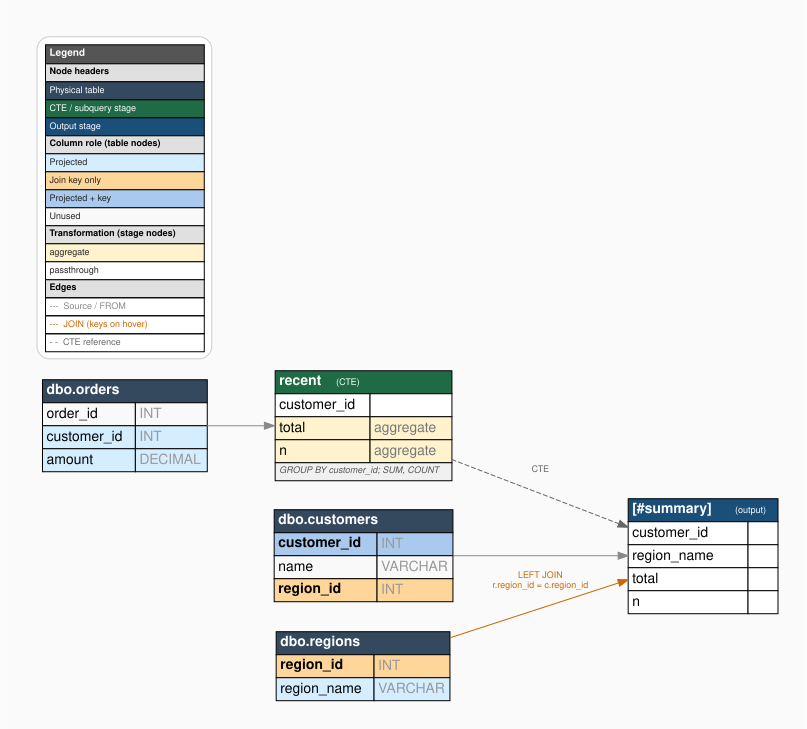
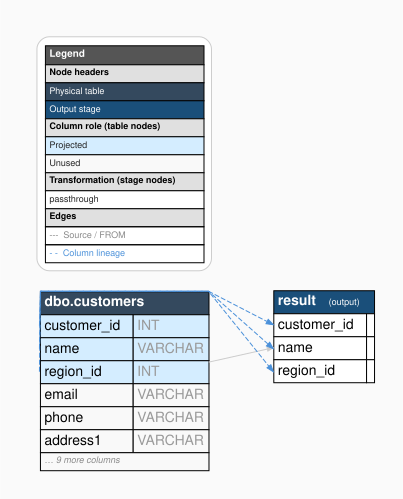
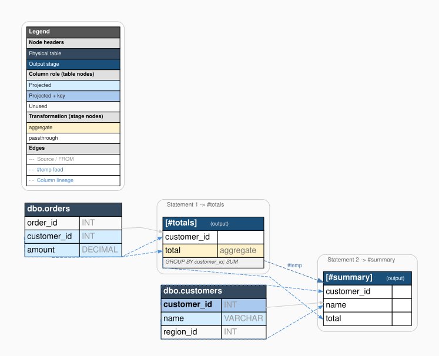

```{r, include = FALSE}
knitr::opts_chunk$set(
  collapse = TRUE,
  comment = "#>"
)
```

```{r setup}
library(Rdataflow)
```

Rdataflow traces the column-level data flow of a SQL script: which columns
each query selects, how tables are joined, and what transformations are
applied at each stage. This vignette walks through the pipeline end to end
using the example from the README.

Diagram rendering (`plot_sqlflow()`) depends on the `DiagrammeR` package,
which is not always available in a headless build environment, so the
diagrams below are pre-generated SVGs (see `data-raw/make_figures.R`)
rather than rendered live. The parsing examples still run live wherever
`sqlglot_available()` is `TRUE`.

## 1. Describe the schema

Column-level lineage needs to know which table each column belongs to.
`schema_from_list()` describes the schema offline; `schema_from_con()` reads
it from a live connection via `INFORMATION_SCHEMA.COLUMNS`.

```{r}
s <- schema_from_list(list(
  "dbo.customers" = c(customer_id = "INT", name = "VARCHAR", region_id = "INT"),
  "dbo.orders"    = c(order_id = "INT", customer_id = "INT", amount = "DECIMAL"),
  "dbo.regions"   = c(region_id = "INT", region_name = "VARCHAR")
))
s
```

## 2. Write the SQL script

This example computes a per-customer order summary in a CTE, joins it back
to `customers` and `regions`, and writes the result into a temp table.

```{r}
sql <- "
  WITH recent AS (
    SELECT o.customer_id, SUM(o.amount) AS total, COUNT(*) AS n
    FROM dbo.orders o
    GROUP BY o.customer_id
  )
  SELECT
    c.customer_id,
    r.region_name,
    recent.total,
    recent.n
  INTO #summary
  FROM dbo.customers c
  JOIN   recent          ON recent.customer_id = c.customer_id
  LEFT JOIN dbo.regions r ON r.region_id      = c.region_id
"
```

## 3. Render the flow diagram

`sql_dataflow()` runs the full pipeline (parse -> IR -> classify -> graph ->
render) in one call:

```r
sql_dataflow(sql, schema = s)
```


Every table column is colour-coded by role (projected / join key / both /
unused), every stage column by transformation type, and dashed blue arrows
trace each output column back to the exact source column(s) that produced
it. Hovering a stage column (in an interactive viewer) shows the full SQL
expression it computes; hovering a join edge shows the join keys.

## 4. The textual narrative

`explain_sqlflow()` renders the same lineage as plain text (or markdown),
handy for a PR description or when a diagram isn't practical:

```{r, eval = Rdataflow::sqlglot_available()}
explain_sqlflow(sql, schema = s)
```

## 5. Structural overview mode

Pass `show_col_edges = FALSE` for a cleaner high-level view: table-to-stage
connections labelled with join types, without the individual column-lineage
arrows. Useful for a first pass over an unfamiliar script.

```r
sql_dataflow(sql, schema = s, show_col_edges = FALSE)
```



## 6. Capping wide tables with `max_cols`

Warehouse tables can have dozens of columns; showing every one makes the
diagram unreadably tall. `max_cols` keeps every projected/join-key column
but caps how many additional unused columns are drawn, summarising the rest
as an "... n more columns" row:

```{r}
wide_schema <- schema_from_list(list(
  "dbo.customers" = c(
    customer_id = "INT", name = "VARCHAR", region_id = "INT",
    email = "VARCHAR", phone = "VARCHAR", address1 = "VARCHAR",
    address2 = "VARCHAR", city = "VARCHAR", state = "VARCHAR",
    postal_code = "VARCHAR", country = "VARCHAR", created_at = "DATETIME",
    updated_at = "DATETIME", loyalty_tier = "VARCHAR", notes = "VARCHAR"
  )
))
maxcols_sql <- "
  SELECT customer_id, name, region_id
  FROM dbo.customers
"
```

```r
sql_dataflow(maxcols_sql, schema = wide_schema, max_cols = 6)
```



## 7. Multi-statement scripts: temp-table chaining

Scripts commonly build up a result across several statements, writing to and
reading back from temp tables. Rdataflow follows a temp table's lineage
across statement boundaries and draws each statement's stages inside its
own labelled cluster, so the structure of a multi-step script stays legible:

```{r}
multi_sql <- "
  SELECT o.customer_id, SUM(o.amount) AS total
  INTO #totals
  FROM dbo.orders o
  GROUP BY o.customer_id;

  SELECT c.customer_id, c.name, t.total
  INTO #summary
  FROM dbo.customers c
  JOIN #totals t ON t.customer_id = c.customer_id;
"
```

```r
sql_dataflow(multi_sql, schema = s)
```



The `#totals` temp table produced by statement 1 is connected (dashed blue
"#temp" edge) to the stage in statement 2 that reads it back, and each
statement's stages are boxed in a labelled cluster ("Statement 1 -> #totals",
"Statement 2 -> #summary").

## Next steps

- `?sql_dataflow` for the full parameter reference.
- `?save_sqlflow` to export `.dot`, `.svg`, `.png`, or `.pdf`.
- The README's "Known limitations" section lists what Rdataflow does not
  (yet) trace.
